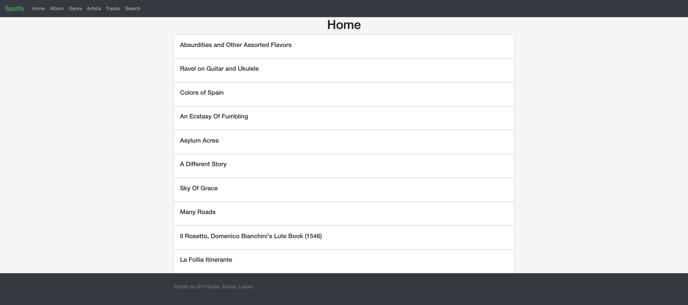
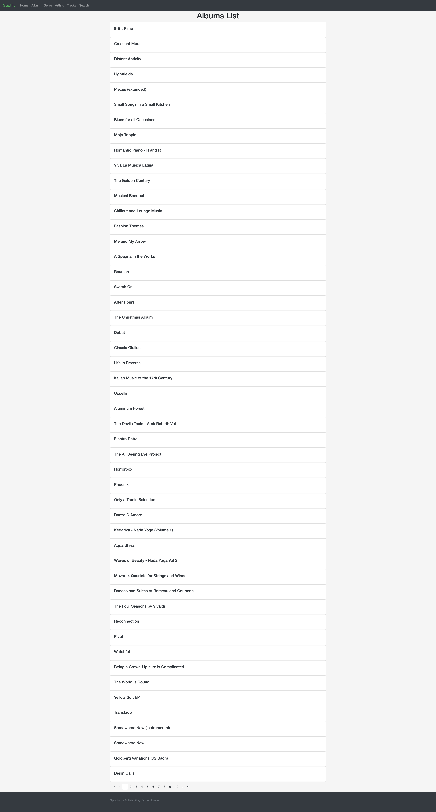
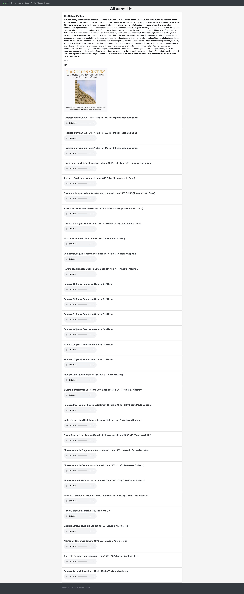
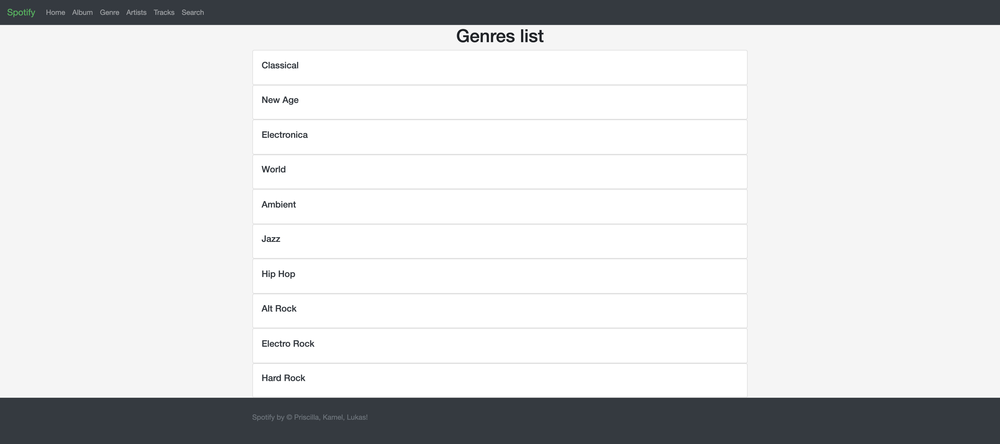
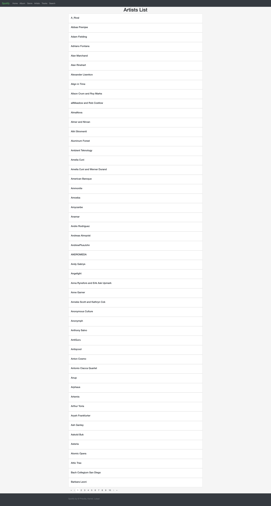
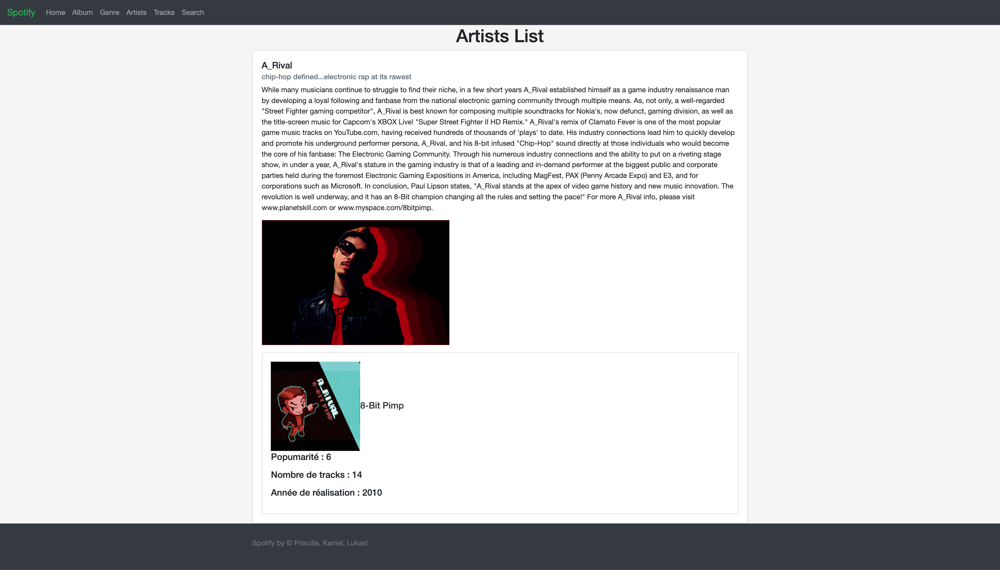

#Rush Spotify 

## Config connect to DB

```bash
    Update password and username in back-end > src > Tools > Databse
    Importe the database in front-end >my_spotify_db.sql
```

## Install composer

```bash
    composer init
    composer install
```

### Start server PHP

```bash
    php -S localhost:8081 -t public
```

### Start React

```bash
    npm install
    npm start
```

### Quit server

```bash
    CTRL C
```

### Dependencies PHP

* illuminate/database -> eloquent
* illuminate/pagination

### Dependencies JS

* React
* react-js-pagination
* react-router-dom


### Links

* https://laravel.com/docs/5.8/eloquent
* https://medium.com/@kshitij206/use-eloquent-without-laravel-7e1c73d79977
* https://stackoverflow.com/questions/34179401/paginating-eloquent-4-2-models-outside-of-laravel
* https://pusher.com/tutorials/consume-restful-api-react

# Website preview









